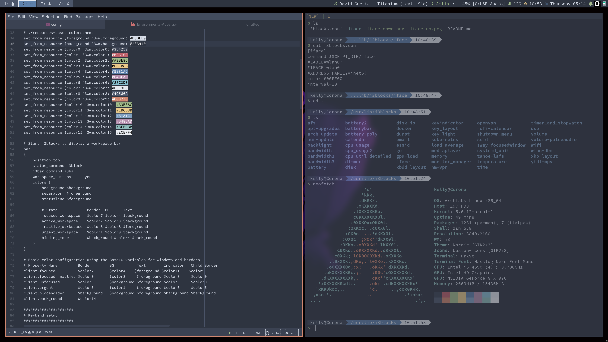

# 

This is my public repo in which I save various dotfiles. I haven't gotten them very robust, so please don't just drop them onto your system. _This will eat puppies and slay kittens._

# Installation

Simple; dead simple.

```
sh -c "$(curl -fsSL https://raw.githubusercontent.com/moonwitch/dotties/master/install.sh)"
```

# Notes

I use submodules to add themes/icons, because some apps still use GTK2 and others GTK3 I have to set both.
It's important to match both themes, otherwise it will look awful.

# Adobe; since I have Photography as hobby

## Enable Lightroom Web
For WebGL to work in Google Chrome (and Chromium), Here are the steps to enable WebGL in Google Chrome.

1. Open Google Chrome
2. Type [chrome://flags](chrome://flags) in the address bar
3. Press Ctrl + f and type ” Rendering list “, “Override software rendering list” should come up, Now click on Enable and restart the browser.
4. Completely kill Chrome: Type `killall chrome` into a terminal.
5. Go to [chrome://settings](chrome://settings) and enable Use hardware acceleration when available. By default it is off since version 43.

# Preview

